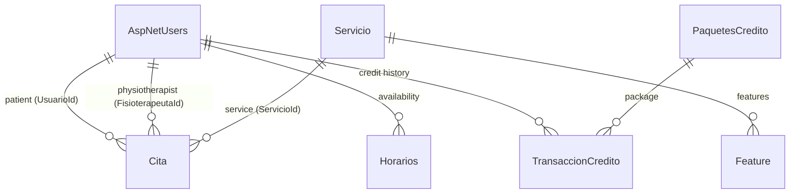

HealthMambo uses Entity Framework Core with a SQL Server backend. The schema is managed entirely through EF Core migrations — you never write `CREATE TABLE` statements by hand. `ApplicationDbContext` inherits from `IdentityDbContext<ApplicationUser>`, so the standard ASP.NET Core Identity tables are created alongside the application's own tables.

## Tables

The following tables are created when you apply migrations:

| Table | Source model | Description |
|---|---|---|
| `AspNetUsers` | `ApplicationUser` + Identity | User accounts for all roles. Includes Identity columns plus `FirstName`, `LastName`, `ImageFileName`, `CreatedAt`, and `CreditosDisponibles`. |
| `AspNetRoles` | `IdentityRole` | The four seeded roles: Admin, Recepcionista, Fisioterapeuta, Paciente. |
| `AspNetUserRoles` | Identity join table | Maps users to their assigned roles. |
| `AspNetUserClaims` | Identity | Claims attached to user accounts. |
| `AspNetUserLogins` | Identity | External login provider records. |
| `AspNetUserTokens` | Identity | Auth tokens such as password reset tokens. |
| `AspNetRoleClaims` | Identity | Claims attached to roles. |
| `Horarios` | `Horario` | Weekly availability windows for physiotherapists. |
| `PaquetesCredito` | `PaqueteCredito` | Credit packages available for purchase. |
| `Servicio` | `Servicio` | Physiotherapy services offered by the clinic. |
| `Feature` | `Feature` | Bullet-point features belonging to a service. |
| `TransaccionCredito` | `TransaccionCredito` | Audit log of credit package assignments. |
| `Cita` | `Cita` | Scheduled appointments. |

## Key relationships



### Cita foreign key behaviors

Two of the three foreign keys on `Cita` point to `AspNetUsers`. SQL Server does not allow both to use cascade delete (this would create multiple cascade paths to the same table). They are configured explicitly in `ApplicationDbContext.OnModelCreating`:

| Relationship | Column | Delete behavior |
|---|---|---|
| `Cita` → patient | `UsuarioId` | `NoAction` — appointment is retained when the patient is deleted. |
| `Cita` → physiotherapist | `FisioterapeutaId` | `NoAction` — appointment is retained when the physiotherapist is deleted. |
| `Cita` → service | `ServicioId` | `SetNull` — `ServicioId` is set to `null` when the service is deleted; the appointment record survives. |

## Applying migrations

<Steps>
  <Step title="Install the EF Core CLI tools">
    If you have not already installed the `dotnet-ef` global tool, run:

    ```bash
    dotnet tool install --global dotnet-ef
    ```
  </Step>
  <Step title="Navigate to the project directory">
    Change to the directory containing `FisioCare-2.csproj`:

    ```bash
    cd path/to/FisioCare-2
    ```
  </Step>
  <Step title="Apply migrations to the database">
    This creates the database if it does not exist and runs all pending migrations:

    ```bash
    dotnet ef database update
    ```

    A successful run ends with a line like `Done.` in the output. The four roles (`Admin`, `Recepcionista`, `Fisioterapeuta`, `Paciente`) are inserted automatically as part of the seed data in `OnModelCreating`.
  </Step>
</Steps>

<Note>
  The connection string in `appsettings.json` must point at a reachable SQL Server instance before running `dotnet ef database update`. See [Configuration reference](/reference/configuration) for connection string setup.
</Note>

## Creating new migrations

When you modify a model class, create a new migration to capture the schema change:

```bash
dotnet ef migrations add DescribeYourChange
dotnet ef database update
```

Migration files are stored in the `Migrations/` directory and should be committed to source control.

## Inspecting the database with SSMS

SQL Server Management Studio (SSMS) is the standard GUI tool for browsing and querying the database.

<Steps>
  <Step title="Connect to the server">
    Open SSMS and connect with:
    - **Server name**: `localhost` (or `localhost\SQLEXPRESS` for a named SQL Server Express instance)
    - **Authentication**: Windows Authentication (matches `Integrated Security=True` in the connection string)
  </Step>
  <Step title="Expand the database">
    In the Object Explorer, expand **Databases** → **FCDB** → **Tables** to see all created tables.
  </Step>
  <Step title="Query a table">
    Right-click any table and choose **Select Top 1000 Rows** to inspect its contents, or open a **New Query** window and write SQL directly:

    ```sql
    SELECT Id, Estado, HoraInicio, UsuarioId, FisioterapeutaId
    FROM Cita
    ORDER BY HoraInicio DESC;
    ```
  </Step>
</Steps>

<Tip>
  The database name defaults to `FCDB` (from `Initial Catalog=FCDB` in the connection string). If you changed this value during setup, use your chosen name instead.
</Tip>
